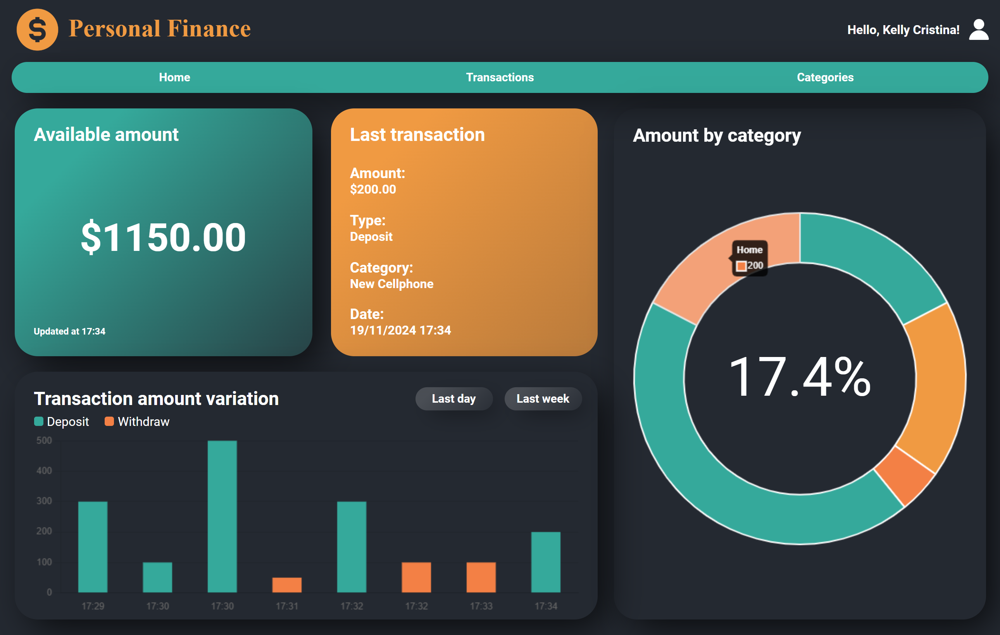
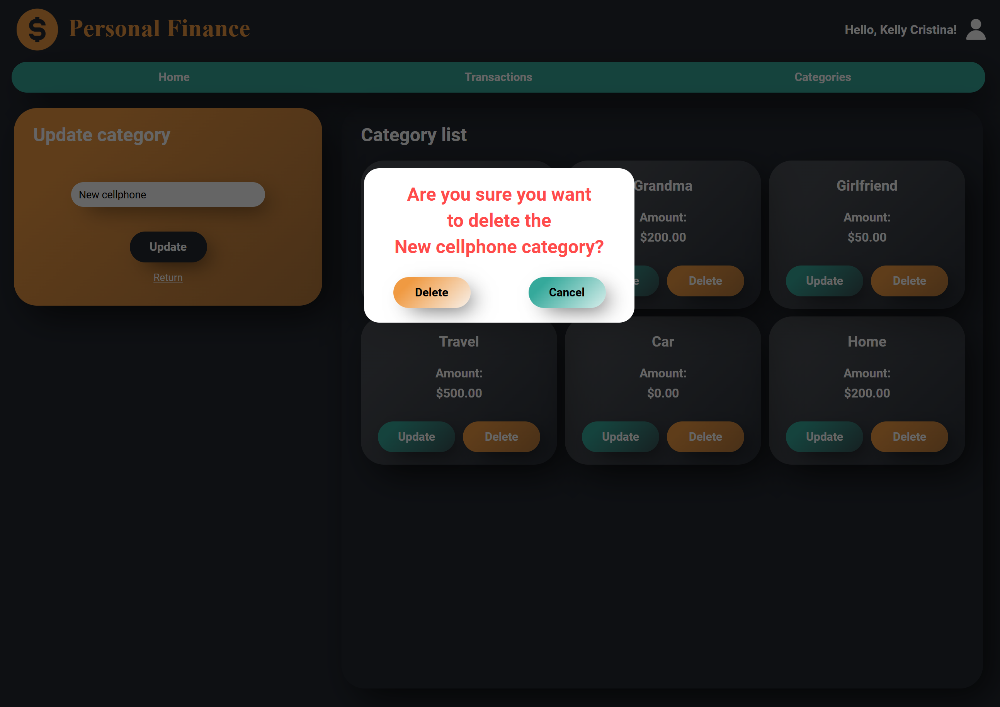

# Interface - Personal Finance

## Sobre o projeto

Esta interface foi desenvolvida para complementar a [API de Finanças Pessoais](https://github.com/kellyfmachado/personal-finance), oferecendo uma experiência prática e intuitiva no gerenciamento financeiro. Com um design focado na organização e clareza, os usuários podem monitorar suas transações, categorias e saldo de maneira eficiente e acessível.

## Tecnologias utilizadas
 


## Estrutura de pastas
  
```
/src
    /app
        /guards          # Proteção de rotas (autenticação e autorização)
        /interceptors    # Manipulação de requisições/respostas HTTP
        /models          # Modelos para tipagem e estruturação de dados
        /pages
            /auth        # Componentes para autenticação (login, registro)
            /index       # Componentes para as páginas principais
        /services        # Serviços para lógica de negócio e comunicação com o backend
    /assets
        /images          # Imagens estáticas usadas na aplicação
        /styles          # Estilos globais (CSS)
    /environments        # Configurações específicas para desenvolvimento e produção
angular.json             # Configurações gerais do Angular CLI
package.json             # Dependências e scripts do projeto
```  

## Rodando localmente

**1º Passo** - Rodar o backend localmente

-   Para acessar todas as funcionalidades da interface, navegue até o [repositório da API de Finanças Pessoais](https://github.com/kellyfmachado/personal-finance) e siga o passo a passo fornecido para configurar e executar o backend em sua máquina.
  
**2º Passo** - Clonar o repositório atual

- Clone o repositório atual em sua máquina local:

```bash
git clone https://github.com/kellyfmachado/front-end-personal-finance
```

**3º Passo** - Navegar até o diretório do projeto
 
- Após o clone, entre no diretório do projeto:

```bash
cd front-end-personal-finance
```

**4º Passo** - Instalar as dependências do projeto

- Execute o seguinte comando para instalar as dependências definidas no `package.json`:

```bash
npm install
```

  **5º Passo** - Iniciar o servidor de desenvolvimento
  
  - Execute o comando para iniciar o servidor localmente:
  
```bash  
npm start
```

  **6º Passo** - Acessar a aplicação 

- Abra o navegador e acesse a URL:

```bash
http://localhost:4200
```

## Interfaces

Autenticação:
- **Registro de usuário**


- **Login**
 

Usuário:

- **Página inicial**


- **Logout**


- **Atualizar usuário**


- **Deletar usuário**


Transações:
- **Criar e listar transações**


- **Atualizar transação**


- **Deletar transação**


Categorias:
- **Criar e listar categorias**


- **Atualizar categoria**


- **Deletar categoria**

